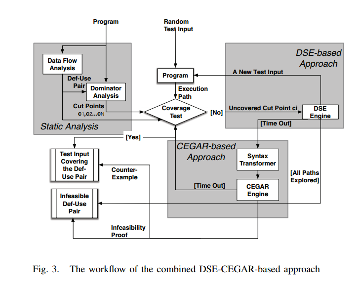

[返回主页](../README.md)
框架目标
=========================
该框架的目标是实现苏亭博士在[Combining Symbolic Execution and Model Checking for Data Flow Testing](https://tingsu.github.io/files/icse15_dft.pdf)中提出的DSE-CEGAR-based方法。希望能够在KLEE上进行一定的修改，能够使用KLEE符号执行引擎，进行数据流覆盖，并且能够使用Cut-point guided search方法进行搜索。
